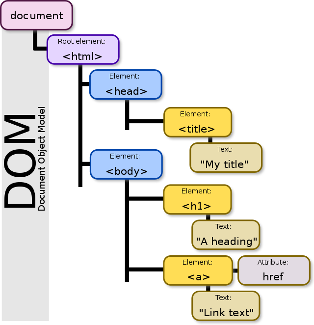

# How Web Scraping Works

You could scrape the old fashioned way, by hand/eye and copy-pasting data from various tables, pages, and sites into another structured format (a spreadsheet, perhaps). Sometimes this is the only way to go, as humans can interpret idiosyncrasies in page and data formatting that machines often cannot. In this case, you’re still undertaking a definable and repeatable set of tasks and performing them in bulk, just not nearly as quickly as a machine could.

Above: The Document Object Model (DOM) displayed in its hierarchical form (Image by Birger Eriksson. Source: [Wikimedia Commons](https://commons.wikimedia.org/wiki/Category:Document_object_models#/media/File:DOM-model.svg))

You could also use Python or other programming language libraries to parse the DOM (Document Object Model), extract the contents of various HTML elements or attributes (a.k.a. “tags” and “classes”), maybe even transform that data in some useful ways (splitting full names into first name/last name columns or performing mathematical calculations on numbers), and writing them to a file. Automated approaches like this look for user-specified HTML elements or classes in a document and/or identify locations within the DOM where the user expects to find data. For example, if I’m compiling a list of phone numbers from a set of profile pages, and each profile page is formatted exactly the same with phone numbers contained by `
` (the paragraph text element with a custom selector applied for styling purposes), I can write a script to open each profile page and grab the contents of that HTML element and class combination. This is exactly the same way that CSS rules target specific HTML elements!

Somewhere in between the scrape-by-hand and scrape-by-code solutions lies the browser extension from [WebScraper.io](https://webscraper.io), a tool that can be installed in Chrome or Firefox. This tool requires no coding knowledge, works through the “Inspect” feature of these web browsers, and can be extremely useful for simple web scraping tasks. 

[<<<Back](02-TOS-ethics.md) | [Next>>>](04-scraper.md)
